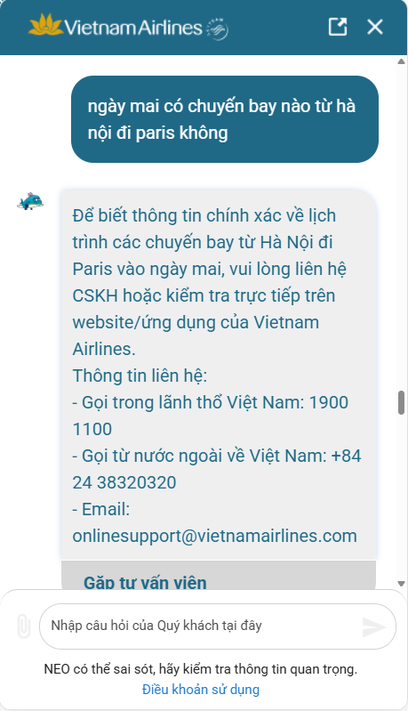
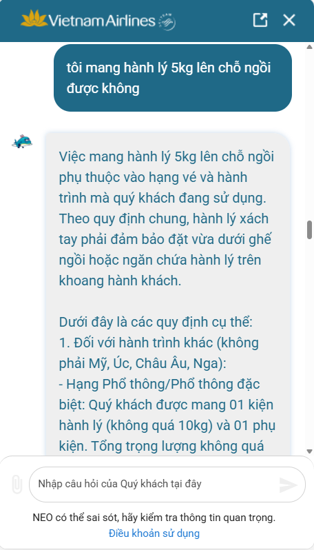

# Workshop — Mổ App AI Thật

**Thời gian:** 35-45 phút  
**Hình thức:** cá nhân trước, chia sẻ theo nhóm sau  
**Output:** finding note + sketch `as-is / to-be`

Mục tiêu không phải chấm "UI đẹp hay xấu". Mục tiêu là dùng sản phẩm thật như một bài needfinding: tìm chỗ product gãy trong workflow thật, rồi viết finding đó thành quyết định product.

## 1. Thông tin sản phẩm

| Sản phẩm | AI feature | Cách truy cập |
|---|---|---|
| Vietnam Airlines — NEO | Chatbot hỗ trợ vé, hành lý, khiếu nại | Website/Zalo VNA |

## 2. Dùng thử: promise vs reality

Promise:

- Là "trợ lý ảo thông minh", giúp khách hàng tra cứu thông tin chuyến bay, quy định hành lý, và hỗ trợ đổi/hoàn vé nhanh chóng 24/7.
- Hành khách của VNA muốn giải quyết nhanh các vấn đề về vé/chuyến bay mà không cần gọi tổng đài.
- Kỳ vọng tra cứu được điều kiện hành lý cho một hạng vé cụ thể và hướng dẫn từng bước đổi vé khi có mã đặt chỗ.
- Khi dùng thật, điểm gãy xuất hiện:
* Khi hỏi lịch bay cụ thể, bot không gọi API dữ liệu mà bắt user tự lên web hoặc gọi tổng đài
* Khi hỏi một câu cần xác nhận Có/Không về hành lý, bot không trả lời thẳng mà ném rất nhiều quy định chung chung.

Evidence:

- Input: ngày mai có chuyến bay nào từ hà nội đi paris không; Output: Để biết thông tin chính xác về lịch trình các chuyến bay từ Hà Nội đi Paris vào ngày mai, vui lòng liên hệ CSKH hoặc kiểm tra trực tiếp trên website/ứng dụng của Vietnam Airlines...

- Input: tôi mang hành lý 5kg lên chỗ ngồi được không; Output: Việc mang hành lý 5kg lên chỗ ngồi phụ thuộc vào hạng vé và hành trình mà quý khách đang sử dụng. Theo quy định chung, hành lý xách tay phải đảm bảo đặt vừa dưới ghế ngồi hoặc ngăn chứa hành lý trên khoang hành khách.

Dưới đây là các quy định cụ thể:
1. Đối với hành trình khác (không phải Mỹ, Úc, Châu Âu, Nga):
- Hạng Phổ thông/Phổ thông đặc biệt: Quý khách được mang 01 kiện hành lý (không quá 10kg) và 01 phụ kiện. Tổng trọng lượng không quá 10kg.
- Hạng Thương gia: Tổng trọng lượng hành lý xách tay không vượt quá 18kg, bao gồm 02 kiện hành lý và 01 phụ kiện...

## 3. Vẽ 4 paths

| Path | Câu hỏi cần trả lời |
|---|---|
| Happy | Ví dụ User hỏi thông tin phổ biến và đúng format FAQ thì bot trả lời được policy tương đối chính xác. |
| Low-confidence | Bot đưa các options cho user. |
| Failure | User hỏi Yes/No question nhưng bot trả lời policy dài dòng. |
| Correction | Khi user sửa, correction có được học lại và trả lời đúng yêu cầu. |

## 4. Viết finding thành quyết định

Finding 1 — Realtime data gap

Khi user hỏi lịch bay cụ thể theo ngày và route,
AI không truy cập dữ liệu chuyến bay mà redirect sang hotline/web,
hậu quả là promise “assistant hỗ trợ tra cứu nhanh” bị phá vỡ và user phải rời workflow.

Lỗi thuộc layer: Data-tool integration + Promise mismatch

Nên sửa bằng
Kết nối API lịch bay realtime.
Nếu chưa có dữ liệu:
hỏi clarify question,
hoặc show CTA “Tra lịch bay”.
Chỉ escalate sang human khi API fail.
SPEC change

“Bot phải có low-confidence fallback trước khi redirect sang CSKH.”

Finding 2 — Policy dump thay vì intent resolution

Khi user hỏi một câu cần answer Có/Không,
AI trả về toàn bộ policy dài thay vì kết luận ngắn,
hậu quả là user phải tự suy luận và tăng cognitive load.

Lỗi thuộc layer: Intent understanding + UX Recovery

Nên sửa bằng

Response format:

Answer ngắn trước
Điều kiện liên quan
Link policy chi tiết nếu cần
Example To-be

“Có, nếu anh/chị bay hạng phổ thông thì 5kg hành lý xách tay được phép mang lên cabin.”

SPEC change

“FAQ answer phải ưu tiên direct resolution trước policy detail.”

## 5. Sketch as-is / to-be

AS-IS
USER
  ↓
Hỏi lịch bay cụ thể
  ↓
BOT
  ↓
Không có API realtime
  ↓
Redirect hotline/web
  ↓
FLOW END

USER
  ↓
Hỏi "5kg có mang lên cabin được không?"
  ↓
BOT
  ↓
Dump toàn bộ policy hành lý
  ↓
USER tự đọc & suy luận
  ↓
Có thể vẫn không chắc answer
Điểm gãy
Không có clarify flow
Không có confidence handling
Không có answer prioritization
Không có recovery path
TO-BE
USER
  ↓
Hỏi lịch bay Hà Nội → Paris ngày mai
  ↓
BOT
  ↓
Check realtime API
  ↓
[If success]
Hiển thị chuyến bay + giờ bay

[If low confidence]
Hỏi thêm:
- giờ mong muốn?
- bay thẳng hay transit?

[If API fail]
Show CTA:
"Tra lịch bay"
+ chuyển CSKH có context
USER
  ↓
"5kg có mang lên cabin được không?"
  ↓
BOT
  ↓
Intent detect:
Yes/No baggage question
  ↓
Trả lời ngắn:
"Có, với hạng phổ thông..."
  ↓
Expand details nếu user cần

## 6. Tự kiểm trước khi nộp

- [ ] Có ít nhất 1 screenshot hoặc observation cụ thể.
- [ ] Có đủ 4 paths hoặc nói rõ path nào chưa có trong product.
- [ ] Finding được viết thành product decision, không chỉ là nhận xét.
- [ ] Sketch có as-is và to-be.
- [ ] Có một câu nói rõ finding này sẽ đổi gì trong SPEC.
